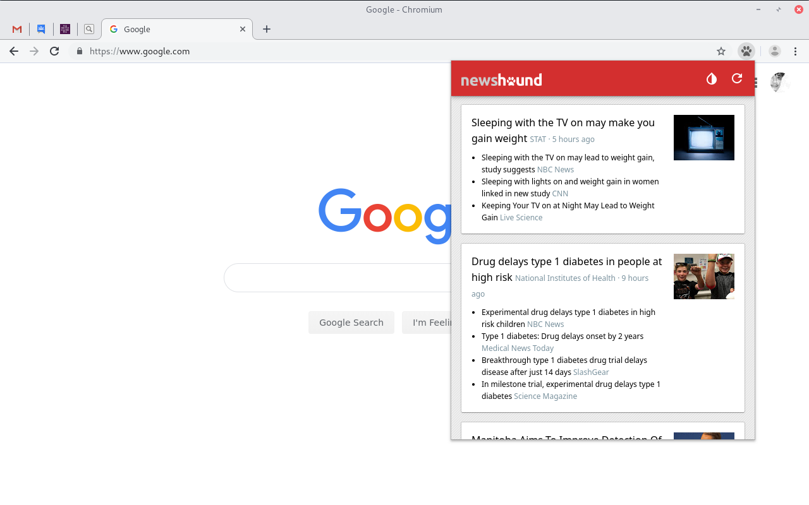
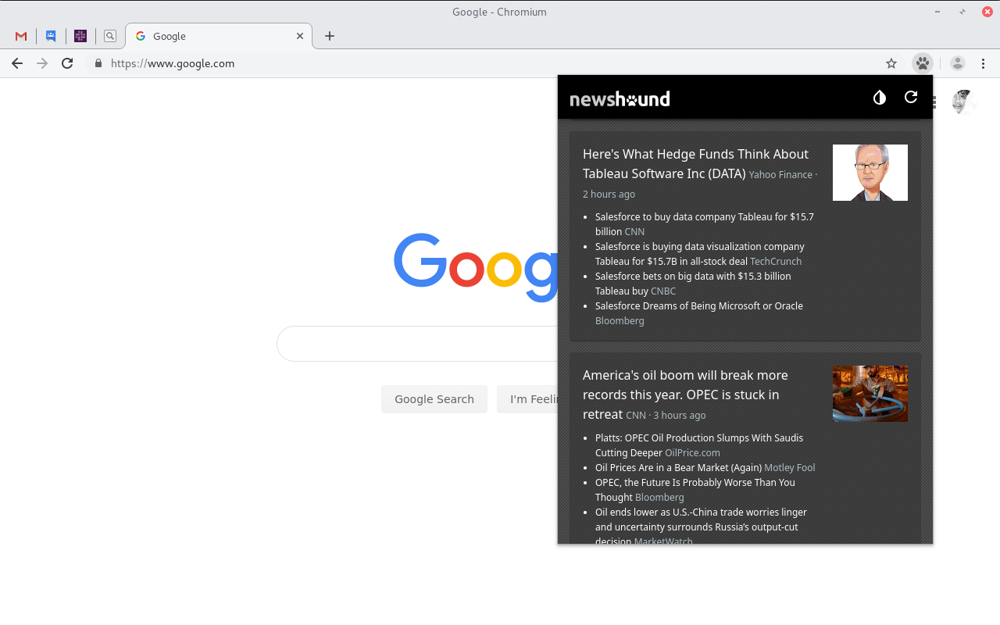

# News Hound

Get the latest news and follow the coverage of breaking news events, local news, national and global politics, and more from the world's top trusted media outlets. News Hound is elegant, simple, fast, and more importantly it does not get in your way.

### Proof of concept

This browser extension uses the [Roadshow](https://github.com/bcosca/roadshow) rendering engine and [ClearCoat](https://github.com/bcosca/clearcoat) user interface components.

### Screenshots

Default layout

Dark mode

[Download News Hound from the Web Store.](https://chrome.google.com/webstore/detail/news-hound/oldaaikodjfajkjopadhhbkbmlgejdpb)

### Support further development of News Hound

Your donations help keep this project ad-free.

[Donate via Paypal](https://www.paypal.com/cgi-bin/webscr?cmd=_s-xclick&hosted_button_id=3VSK6CKUYZRBL&source=url)

## Support on Beerpay
Hey dude! Help me out for a couple of :beers:!

  